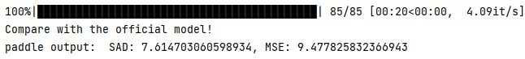

##BackgroundMattingV2-paddle

---
人工智能创新应用大赛——飞桨开源框架前沿模型复现专题赛，使用Paddle复现Real-Time-High-Resolution-Background-Matting论文。
#### 验收标准：PhotoMatte85 SAD: 8.65，MSE: 9.57 | 复现精度：SAD: 7.61，MSE: 9.47 


注：按照原论文中设计的测试集，会对数据使用随机增广，故结果会有波动。

---


###1.模型下载
链接：https://pan.baidu.com/s/1WfpzLcjaDJPXYSrzPWvsyQ 
提取码：nsfy

###2. 验证
``` 
python eval.py --data-path --model-path
``` 

###3. 训练
``` 
python train_refiner.py
``` 

### note:
1.原作者没有提供一个数据集，我增加了自己数据进行训练，没有条件的话可以使用原工程生成pha作为训练数据。

2.由于时间比较紧迫（我在截稿前一周才知道的比赛），代码没有整理，训练由于算子问题还有bug，后面有时间向百度的同学请教再更新。

3.添加了原作者新论文中用到的laplacian_loss，可以提高收敛速度。

4.[模型api对照表](https://blog.csdn.net/qq_32097577/article/details/112383360?utm_medium=distribute.pc_relevant.none-task-blog-2%7Edefault%7EBlogCommendFromMachineLearnPai2%7Edefault-2.vipsorttest&depth_1-utm_source=distribute.pc_relevant.none-task-blog-2%7Edefault%7EBlogCommendFromMachineLearnPai2%7Edefault-2.vipsorttest)