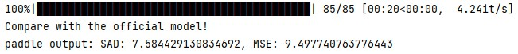

## BackgroundMattingV2-paddle

更新： 增加训练过程，完整训练日志在log中

---
人工智能创新应用大赛——飞桨开源框架前沿模型复现专题赛，使用Paddle复现Real-Time-High-Resolution-Background-Matting论文。
#### 验收标准：PhotoMatte85 SAD: 8.65，MSE: 9.57 | 复现精度：SAD: 7.58，MSE: 9.49 


注：按照原论文中设计的测试集，会对数据使用随机增广，故结果会有波动。

---

### 1.模型下载
链接：https://pan.baidu.com/s/140EWboy_Z3xrQ1TlvEQOgQ 
提取码：6fnd

### 2. 验证
``` 
python eval.py --data-path --model-path
``` 

### 3. 训练
``` 
python train_refiner.py
``` 
* stage1：使用VideoMatte240K数据集做预训练，提升模型鲁棒性。

注：由于预训练耗时较长，提供了训练好得模型，方便在自己的数据上微调，模型为stage1.pdparams。

* stage2：使用Distinctions646数据集做微调，提升模型细节表现。

注：此时模型最好精度为SAD: 7.58，MSE: 9.49，模型为stage2.pdparams。

* **stage3：使用个人数据集微调。

注：本次比赛提交的是stage2模型，因为训练所用数据集都为公开数据集，方便复现。
原作者在论文中也使用了个人数据集微调，但没有公开。因此我增加了自己数据进行训练，没有条件的同学可以利用原工程生成pha作为训练数据。
模型最好精度为SAD: 7.61，MSE: 9.47，模型为stage3.pdparams。

### note:

1.添加了原作者新论文中用到的laplacian_loss，可以提高收敛速度。

2.[模型api对照表](https://blog.csdn.net/qq_32097577/article/details/112383360?utm_medium=distribute.pc_relevant.none-task-blog-2%7Edefault%7EBlogCommendFromMachineLearnPai2%7Edefault-2.vipsorttest&depth_1-utm_source=distribute.pc_relevant.none-task-blog-2%7Edefault%7EBlogCommendFromMachineLearnPai2%7Edefault-2.vipsorttest)