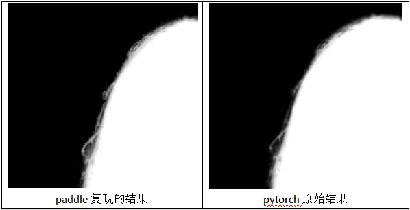

# BackgroundMattingV2

---

[English](./README.md) | 简体中文
   
   * [BackgroundMattingV2](#BackgroundMattingV2)
      * [一、简介](#一简介)
      * [二、复现精度](#二复现精度)
      * [三、数据集](#三数据集)
      * [四、环境依赖](#四环境依赖)
      * [五、快速开始](#五快速开始)
         * [step1: clone](#step1-clone)
         * [step2: 训练](#step2-训练)
         * [step3: 测试](#step3-测试)
      * [六、代码结构与详细说明](#六代码结构与详细说明)
         * [6.1 代码结构](#61-代码结构)
         * [6.2 参数说明](#62-参数说明)
         * [6.3 训练流程](#63-训练流程)
      * [七、模型信息](#七模型信息)

## 一、简介

人工智能创新应用大赛——飞桨开源框架前沿模型复现专题赛，使用Paddle复现Real-Time-High-Resolution-Background-Matting论文。
该方法中将整个pipeline划分为两个部分：base和refine部分，前一个部分在缩小分辨率的输入下生成粗略的结果输出，其主要用于提供大体的区域位置定位（coarse predcition）。后一个网络在该基础上通过path selection选取固定数量的path（这些区域主要趋向于选择头发/手等难分区域）进行refine，之后将path更新之后的结果填充回原来的结果，从而得到其在高分辨率下的matting结果。


**论文:**
- [1] Shanchuan Lin, Andrey Ryabtsev, Soumyadip Sengupta, Brian Curless, Steve Seitz, and Ira Kemelmacher Shlizerman.
  Real-time high-resolution background matting. 
  In Computer Vision and Pattern Regognition (CVPR), 2021.

**参考项目：**
- [https://github.com/PeterL1n/BackgroundMattingV2](https://github.com/PeterL1n/BackgroundMattingV2)

**项目aistudio地址：**
- notebook任务：[https://aistudio.baidu.com/aistudio/projectdetail/2467759](https://aistudio.baidu.com/aistudio/projectdetail/2467759)

## 二、复现精度
#### 验收标准：PhotoMatte85 SAD: 8.65，MSE: 9.57 | 复现精度：SAD: 7.58，MSE: 9.49 



>该列指标在PhotoMatte85的测试集测试

| |epoch|opt|learning_rate|pretrain|dataset|SAD|MSE|
| :---: | :---: | :---: | :---: | :---: | :---: | :---: | :---: |
|stage1|1|Adam|1e-4|none|VideoMatte240K|11.68|12.85|
|stage2|300|Adam|5e-5|stage1.model(step_109999)|Distinctions646_person|7.58|9.49|
|stage3|300|Adam|3e-5|stage2.model(epoch_169)|private|7.61|9.47|


**模型下载**
链接：https://pan.baidu.com/s/1WfpzLcjaDJPXYSrzPWvsyQ 
提取码：nsfy
## 三、数据集

 [VideoMatte240K & PhotoMatte85 数据集](https://grail.cs.washington.edu/projects/background-matting-v2/#/datasets)

- 数据集大小：
  - 训练集：237,989张
  - 测试集：2,720张
  - 测试集：85张


[Distinctions646_person 数据集](https://github.com/cs-chan/Total-Text-Dataset)

- 数据集大小：
  - 训练集：362张
  - 测试集：11张


## 四、环境依赖

- 硬件：GPU、CPU

- 框架：
  - PaddlePaddle == 2.1.2

## 五、快速开始

### step1: clone 

```bash
# clone this repo
git clone https://github.com/PaddlePaddle/Contrib.git
cd BackgroundMattingV2
export PYTHONPATH=./
```

### step2: 训练
```bash
sh ./run.sh
```

由于是分割任务，需要关注 ``loss`` 逐渐降低，``SAD``、``MSE`` 逐渐降低。

### step3: 测试
```bash
python3 eval.py 
```
按照原论文中设计的测试集，会对数据使用随机增广，故结果会有波动。

### 使用预训练模型预测
```bash
python3 predict.py
```

输出图片保存在 ./image 目录下

## 六、代码结构与详细说明

### 6.1 代码结构

```
├─dataset                         # 数据集加载
├─image                           # 图片
├─log                             # 训练日志
├─model                           # 模型
├─utils                           # 工具代码
│  eval.py                        # 评估
│  predict.py                     # 预测
│  README.md                      # 英文readme
│  README_cn.md                   # 中文readme
│  run.sh                         # 训练脚本
│  train.py                       # 训练
```

### 6.2 参数说明

可以在 `train.py` 中设置训练与评估相关参数，具体如下：

|  参数   |  说明 |
|  ----  |  ----  |
| --dataset-name| 数据集 |
| --learning-rate|学习率|
| --log-train-loss-interval | 打印loss步数 |
| --epoch_end| 训练epoch数 |
| --pretrain| 预训练模型参数路径 |


### 6.3 训练流程
``` 
sh ./run.sh
``` 
* stage1：使用VideoMatte240K数据集做预训练，提升模型鲁棒性。

注：由于预训练耗时较长，提供了训练好得模型，方便在自己的数据上微调，模型为stage1.pdparams。

* stage2：使用Distinctions646数据集做微调，提升模型细节表现。

注：此时模型最好精度为SAD: 7.58，MSE: 9.49，模型为stage2.pdparams。

* **stage3：使用个人数据集微调。

注：本次比赛提交的是stage2模型，因为训练所用数据集都为公开数据集，方便复现。
原作者在论文中也使用了个人数据集微调，但没有公开。因此我增加了自己数据进行训练，没有条件的同学可以利用原工程生成pha作为训练数据。
模型最好精度为SAD: 7.61，MSE: 9.47，模型为stage3.pdparams。

* note：

1.添加了原作者新论文中用到的laplacian_loss，可以提高收敛速度。

2.[模型api对照表](https://blog.csdn.net/qq_32097577/article/details/112383360?utm_medium=distribute.pc_relevant.none-task-blog-2%7Edefault%7EBlogCommendFromMachineLearnPai2%7Edefault-2.vipsorttest&depth_1-utm_source=distribute.pc_relevant.none-task-blog-2%7Edefault%7EBlogCommendFromMachineLearnPai2%7Edefault-2.vipsorttest)

## 七、模型信息

关于模型的其他信息，可以参考下表：

| 信息 | 说明 |
| --- | --- |
| 发布者 | 赵家磊|
| 时间 | 2021.10 |
| 框架版本 | Paddle 2.1.2 |
| 应用场景 | 视频图片高精度抠像 |
| 支持硬件 | GPU、CPU |
| 下载链接 | [链接](https://pan.baidu.com/s/140EWboy_Z3xrQ1TlvEQOgQ)  提取码：6fnd  |
| 在线运行 | [botebook](https://aistudio.baidu.com/aistudio/projectdetail/2467759)|
